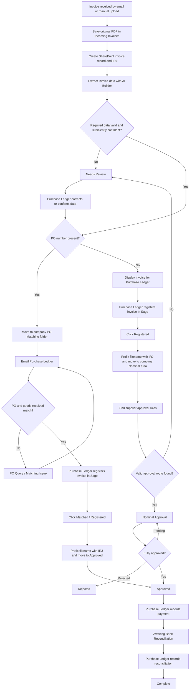

# General Invoice Process

## Purpose

This document expands section 2 of the project specification into an implementation-ready process. The first version should use Microsoft 365 low-code services:

- Power Automate for workflow orchestration
- SharePoint for document storage, invoice metadata, configuration, and operational views
- AI Builder for invoice data extraction
- Microsoft Approvals for nominal invoice approval
- Power BI for later reporting

Traditional custom code is not required for the initial version.

## Core Design Principles

1. Create and retain the invoice record before attempting AI extraction.
2. Give every invoice a unique IRJ reference before Purchase Ledger registers it in Sage.
3. Keep one canonical PDF and move that file through controlled SharePoint folders without creating process copies.
4. Store the process stage and extracted data as SharePoint metadata.
5. Use SharePoint views to show operational queues such as `Needs Review` and `Awaiting Approval`.
6. Never allow automation to guess when required data is missing or uncertain.
7. Record every important automated and human action in an audit history.
8. Keep approval matrices and other business rules outside the Power Automate flows so authorised users can maintain them.

## High-Level Flow



## SharePoint Foundation

### Invoice Register and Document Library

Each invoice should have one SharePoint record and one canonical PDF. The IRJ number links them throughout the process.

Recommended approach:

- Save the unmodified attachment in `Incoming Invoices`.
- Create the Invoice Register item and link it to the saved PDF.
- Use its SharePoint item ID to generate an IRJ such as `IRJ-001245`.
- Store the IRJ as metadata immediately so Purchase Ledger can use it during Sage registration.
- Keep the original filename while the invoice is being extracted and reviewed.
- Prefix the filename with the IRJ only after Purchase Ledger clicks `Registered` or `Matched / Registered`.
- Move the same canonical file into the relevant company process folder; do not create uncontrolled duplicate copies.

### Configuration Lists

| List | Purpose |
| --- | --- |
| Companies | Maps company names, addresses, VAT numbers, aliases, and SharePoint destinations |
| Suppliers | Stores normalised supplier details and identifiers |
| Approval Matrix | Maps company and supplier to Approver 1, optional Approver 2, and effective dates |
| Process Configuration | Stores maintainable thresholds, notification recipients, and other workflow settings |
| Invoice History | Records significant status changes, decisions, comments, errors, and responsible users |

## Process Stages

### 1. Receive the Invoice

#### Email route

Power Automate monitors the designated shared invoice mailbox.

For each incoming message:

1. Record the email message ID, sender, received date, and subject.
2. Inspect the attachments.
3. Accept supported PDF invoice attachments.
4. Process each invoice attachment as a separate invoice.
5. Ignore unsupported attachments or flag them according to the agreed mailbox rules.

#### Manual route

Purchase Ledger can manually upload a PDF through a controlled SharePoint intake location or form. The manual route must initiate the same process as the email route.

#### Initial status

Set the invoice status to `Incoming / Processing`.

### 2. Save the Incoming PDF and Create the Invoice Record

Before AI Builder is called:

1. Save the original PDF in the SharePoint `Incoming Invoices` folder.
2. Create an item in the Invoice Register.
3. Record the source as `Email` or `Manual`.
4. Retain available email metadata.
5. Record the original filename and incoming SharePoint file identifier.
6. Record the SharePoint-created timestamp and flow run identifier.

This step ensures an invoice remains visible and recoverable if a later action fails.

### 3. Generate the IRJ Number

Use the unique SharePoint Invoice Register item ID as the sequence source.

Example:

```text
Invoice Register item ID: 1245
IRJ number: IRJ-001245
```

The flow should:

1. Format the item ID using the agreed prefix and zero-padding.
2. Save the IRJ on the Invoice Register item.
3. Display it in the application for Purchase Ledger to use when registering the invoice in Sage.
4. Use it in notifications, approvals, logs, and Power BI reporting.
5. Add it to the PDF filename only after the user confirms registration.

The final format and whether numbering resets annually must be confirmed before implementation.

### 4. Extract Invoice Information

Call AI Builder's invoice-processing model using the saved PDF.

Attempt to extract:

- Company being invoiced
- Supplier
- Supplier invoice number
- Purchase Order number
- Invoice date
- Total invoice value
- Currency, if required
- Relevant company identifiers such as address or VAT number

Store both the extracted values and, where available, their confidence scores.

### 5. Display the Invoice in the Application

The front-end application should show:

- A preview or secure link to the PDF
- The generated IRJ number
- All extracted invoice fields
- AI confidence or review warnings where useful
- The current SharePoint location and process status
- Actions available to the current user

Purchase Ledger must be able to correct extracted values before the invoice continues.

### 6. Validate the Extraction

The flow should validate:

- The PDF was read successfully.
- The company can be mapped to a Companies-list record.
- The supplier is present or can be matched reliably.
- The supplier invoice number is present.
- The invoice date and value are usable.
- The PO number is present or confirmed absent.
- Required confidence scores meet configured thresholds.

If validation fails:

1. Set status to `Needs Review`.
2. Record a specific review reason.
3. Notify or expose the item to Purchase Ledger.
4. Stop automatic routing until a user corrects and confirms the information.

### 7. Check for Duplicates

Before routing, compare the invoice with existing active and completed records.

Suggested duplicate key:

```text
Company + Supplier + Supplier Invoice Number
```

Invoice value and date can provide secondary evidence. A possible duplicate must be placed in `Needs Review`; it must not be automatically deleted.

### 8. Determine the Invoice Route

After validation:

- If a PO number is present, set the invoice type to `PO` and start the Purchase Order route.
- If no PO number is present, set the invoice type to `Nominal`, set status to `Awaiting Sage Registration`, and present it for normal Sage registration.
- If the PO value is unclear, set status to `Needs Review`.

## Purchase Order Route

### 9. Await PO Matching

When AI Builder confidently detects a PO number:

1. Set status to `Awaiting PO Matching`.
2. Move the canonical PDF from `Incoming Invoices` into the relevant company's `Purchase Order Invoice Matching` folder.
3. Retain the file identifier, destination, extracted metadata, and IRJ on the Invoice Register.
4. Email Purchase Ledger that a PO invoice is ready for matching.

The email should include:

- IRJ number
- Company
- Supplier
- Supplier invoice number
- Purchase Order number
- Invoice date and value
- Secure link to the PDF
- Link to the invoice record or application matching screen

Purchase Ledger manually compares the invoice with:

- The Purchase Order
- Goods received information
- Price and quantity details
- Other relevant purchasing records

### 10. Record the Matching Decision

#### Successful match

After confirming the match, Purchase Ledger registers the invoice in Sage using the displayed invoice information and IRJ. They then select `Matched / Registered`.

The system should:

1. Validate that required invoice information and the IRJ are present.
2. Record the user, Sage registration confirmation, and date.
3. Prefix the PDF filename using `{IRJ}_{original-filename}.pdf`.
4. Move the PDF into the relevant company's `Approved` folder.
5. Preserve the SharePoint link and metadata.
6. Add an Invoice History entry.
7. Set the invoice status to `Approved`.
8. Make it available in the Approved operational view.

#### Matching issue

Purchase Ledger records:

- Query category
- Query details
- Purchasing contact
- Date raised

Keep the status as `Awaiting PO Matching` and record the query against that
stage.

Notify the relevant Purchasing contact where required. Recording the query
must not move the PDF or move the invoice to another workflow stage. It
remains in the PO matching area and stays outstanding until Purchase Ledger
explicitly marks it matched or rejected. The original query and resolution
notes must remain in the history.

## Sage Registration for Nominal Invoices

### 11. Register the Nominal Invoice

If no PO number is detected, the application should display the invoice and extracted information for Purchase Ledger.

Purchase Ledger should:

1. Review and correct the extracted information.
2. Register the invoice manually in Sage using the displayed IRJ.
3. Click `Registered` in the application.

The system should then:

1. Validate the required metadata and IRJ.
2. Record who registered the invoice and when.
3. Prefix the PDF filename using `{IRJ}_{original-filename}.pdf`.
4. Move the PDF from `Incoming Invoices` into the relevant company's nominal invoice area.
5. Set the invoice status to the first applicable approval status.
6. Continue to approval-matrix lookup.

## Nominal Invoice Route

### 12. Resolve the Approval Route

Look up an active Approval Matrix row using the identified company and supplier.

The result should contain:

- Approver 1
- Whether Approver 2 is required
- Approver 2, where applicable
- Effective dates or other agreed routing conditions

If no valid route exists, set status to `Needs Review`.

### 13. Run Approval 1

Set status to `Awaiting Approval 1` and start a Microsoft Approval containing:

- IRJ number
- Company
- Supplier
- Supplier invoice number
- Invoice date and value
- Secure link to the SharePoint PDF
- Instructions for adding meaningful comments

Record the approval request identifier.

#### Approval

Record the approver, date, outcome, and comments.

- If no second approval is required, set status to `Approved`.
- If a second approval is required, continue to Approval 2.

#### Rejection

Require a rejection reason, record the decision, and set status to `Rejected`. The invoice must not proceed to payment.

#### Query or delay

Where the approval mechanism supports it, record the reason against the
current `Awaiting Approval 1` or `Awaiting Approval 2` stage. Recording or
resolving a query must not move the PDF or change its approval stage. Only an
explicit approval or rejection advances or removes it from that stage.

### 14. Run Approval 2

Set status to `Awaiting Approval 2` and send the second approval only after Approval 1 succeeds.

Record the second decision independently.

- Approval sets the invoice status to `Approved`.
- Rejection sets the invoice status to `Rejected`.
- A query places the invoice on hold using the same controlled process as Approval 1.

## Approved, Payment, and Reconciliation

### 15. Approved

An invoice reaches `Approved` after either:

- Successful PO matching; or
- Completion of all required nominal approvals.

The system should:

1. Record the source of approval.
2. Notify Purchase Ledger where required.
3. Show the invoice in the Approved view.
4. Prevent unauthorised users from marking it as paid.

### 16. Record Payment

Purchase Ledger deliberately marks the invoice as paid and enters:

- Payment date
- Payment reference or run reference
- Optional payment notes

The system records who performed the action, writes a history entry, and sets status to `Paid / Awaiting Bank Reconciliation`.

Approval must never trigger payment automatically.

### 17. Record Bank Reconciliation

Purchase Ledger deliberately records:

- Reconciliation date
- User completing reconciliation
- Optional reconciliation notes

The system writes a history entry and sets status to `Reconciled / Complete`.

## Status Model

| Status | Meaning | Typical owner |
| --- | --- | --- |
| Incoming / Processing | Record created and automated processing is underway | System |
| Needs Review | Automation cannot safely continue | Purchase Ledger / Administrator |
| Awaiting Sage Registration | Valid nominal invoice is ready to be registered in Sage | Purchase Ledger |
| Awaiting PO Matching | PO invoice needs manual matching | Purchase Ledger |
| Awaiting Approval 1 | First nominal approval is outstanding | Approver 1 |
| Awaiting Approval 2 | Second nominal approval is outstanding | Approver 2 |
| Rejected | Approval was rejected and processing has stopped | Purchase Ledger |
| Approved | Matching or required approvals are complete | Purchase Ledger |
| Paid / Awaiting Bank Reconciliation | Payment has been recorded | Purchase Ledger |
| Reconciled / Complete | Invoice has completed the workflow | Purchase Ledger |

## Exception Handling

Every failed or uncertain operation should:

1. Preserve the invoice record and PDF.
2. Set a meaningful status, normally `Needs Review`.
3. Store a concise error or review reason.
4. Record the failed flow name, run ID, and timestamp where practical.
5. Notify the appropriate support owner for critical automation failures.
6. Allow an authorised user to correct the data and restart from a defined stage.

Examples include:

- Unsupported or unreadable PDF
- AI Builder failure or low confidence
- Unknown company or supplier
- Missing approval configuration
- Possible duplicate invoice
- Filename collision or invalid destination folder
- SharePoint file rename or move failure
- Purchase Ledger notification email failure
- Power Automate connector failure
- Approval request failure
- SharePoint write conflict

## Audit History

Create an Invoice History entry for at least:

- Invoice received
- IRJ assigned
- PDF saved
- Extraction completed or failed
- Manual review requested and completed
- Route selected
- PDF moved to PO matching or nominal processing area
- Purchase Ledger PO notification sent
- PO query raised and resolved
- Sage registration confirmed
- PDF renamed with its IRJ prefix
- Approval requested, approved, rejected, or placed on hold
- Status changed
- Payment recorded
- Reconciliation recorded
- Flow failure and restart

The web application exposes this history when an invoice is found by IRJ
number. The search result shows the invoice's current status and its
invoice-specific, timestamped event history in chronological order.

Stage email delivery is idempotent. A persistent `(invoice, stage)` claim is
created before sending the PO matching, Approver 1, Approver 2, or approved-for-
payment email. Returning from a query/hold, retrying an action, or revisiting a
stage must not send that stage's email again.

Each entry should include:

- IRJ number
- Event type
- Previous and new status
- Timestamp
- User or automated process
- Comments or reason
- Related approval or flow identifier where relevant

## Suggested Power Automate Flows

Avoid one very large flow. Use focused flows with clear ownership and restart points.

| Flow | Trigger | Responsibility |
| --- | --- | --- |
| Invoice Email Intake | New email in shared mailbox | Validate attachments and initiate each invoice |
| Manual Invoice Intake | New file or submitted intake form | Initiate manually received invoices |
| Invoice Registration | Called by intake flow | Save the PDF in Incoming Invoices, then create its register record and IRJ |
| Invoice Extraction and Routing | Registered invoice | Extract, validate, duplicate-check, display in the application, and select the PO or nominal route |
| PO Routing Notification | Valid PO invoice | Move it to the company PO matching folder and notify Purchase Ledger |
| Manual Review Resumption | Invoice marked ready after review | Revalidate and resume routing |
| PO Matching Update | PO matching action recorded | Apply query outcomes or confirm matching, Sage registration, IRJ rename, and movement to Approved |
| Nominal Sage Registration | Purchase Ledger clicks Registered | Record registration, prefix the filename, move it to the company nominal area, and start approvals |
| Nominal Approval | Valid nominal route | Run sequential approvals and record outcomes |
| Payment Update | Payment action recorded | Validate and record payment |
| Reconciliation Update | Reconciliation action recorded | Complete the workflow |
| Monitoring and Escalation | Scheduled | Find overdue work, failed states, and stalled approvals |

## Operational SharePoint Views

- Incoming / Processing
- Needs Review
- Awaiting Sage Registration
- Awaiting PO Matching
- PO Queries
- Awaiting Approval 1
- Awaiting Approval 2
- Approval Queries / On Hold
- Rejected
- Approved for Payment
- Awaiting Bank Reconciliation
- Complete
- My Approvals or My Outstanding Invoices

## Decisions Required Before Building

1. Confirm the IRJ format and whether numbering resets.
2. Confirm the duplicate-detection key and manual duplicate process.
3. Define company-identification values such as registered names, addresses, and VAT numbers.
4. Define AI Builder confidence thresholds for each critical field.
5. Confirm whether the supplier must exist in a Suppliers list before routing.
6. Define how approvers place an invoice on hold and resume it.
7. Define reminder and escalation timing.
8. Define who can edit configurations, correct extracted data, approve, record payment, and reconcile.
9. Confirm invoice retention and deletion requirements.
10. Confirm expected invoice volume and peak mailbox activity.
11. Confirm whether the accounting system requires integration in a later phase.

## Initial Delivery Stages

1. **Foundation:** Create SharePoint lists, library, metadata, permissions, statuses, and views.
2. **Intake:** Build email/manual receipt, invoice registration, IRJ generation, and PDF storage.
3. **Extraction:** Add AI Builder, validation, duplicate detection, and manual review.
4. **PO route:** Add manual matching, queries, and approval transition.
5. **Nominal route:** Add approval-matrix lookup and sequential approvals.
6. **Completion:** Add payment and reconciliation actions.
7. **Operations:** Add reminders, escalation, monitoring, and Power BI reporting.
