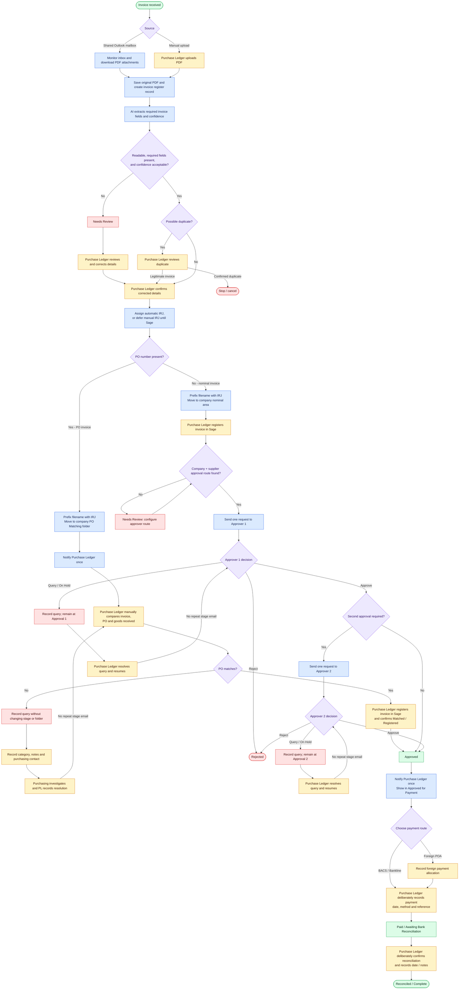

# Invoice Processing Workflow Flowchart

This flowchart represents the original end-to-end invoice logic, including:

- Outlook and manual invoice intake
- IRJ generation after Purchase Ledger confirmation (or at Sage for companies
  configured for manual IRJ numbering)
- AI extraction, validation, review, and duplicate checks
- Purchase Order matching and query resolution
- Nominal invoice registration and one/two-level approval routing
- Payment recording and bank reconciliation
- Safe exception handling without automatic guessing

## Legend

- **Blue:** automated system action
- **Yellow:** manual human action
- **Purple:** decision
- **Red:** exception, hold, rejection, or cancellation
- **Green:** major lifecycle state

The editable Mermaid-only source is available in `INVOICE_WORKFLOW_FLOWCHART.mmd`.

## Implementation confirmation

| Flow area | Implemented by | Verified behavior |
|---|---|---|
| Outlook and manual intake | `app/outlook_worker.py`, `app/sharepoint_intake.py`, `app/main.py` | Both routes create the same invoice record and extraction stage. |
| Extraction and review | `InvoiceLifecycle.run_extraction`, `confirm_and_route` | Unreadable, incomplete, low-confidence, unknown-company, and unknown-supplier results stop for Purchase Ledger review; no value is guessed. |
| Duplicate decision | `app/duplicates.py`, `confirm_and_route`, `cancel_confirmed_duplicate` | Possible duplicates stop for review and can only continue after explicit override or be cancelled. |
| PO flow | `confirm_and_route`, `record_po_match`, `register_in_sage` | PO queries preserve the PO-matching stage and folder; only explicit match advances to Sage and approval. |
| Nominal flow | `register_in_sage`, `decide_approval`, `resume_approval` | Missing routes stop for configuration; approvals are sequential; query/hold metadata never advances or moves the invoice. |
| Stage notifications | `InvoiceLifecycle._send_stage_email_once` | PO matching, Approver 1, Approver 2, and approved-for-payment each have one persistent email claim per invoice; query/resume loops cannot resend them. |
| Payment and reconciliation | `route_for_payment`, `mark_paid`, `mark_foreign_allocated`, `mark_reconciled` | Payment routing, deliberate payment recording, and deliberate reconciliation are separate guarded transitions. |
| Audit and lookup | `ActivityFeedStore`, `PostgresActivityFeedStore`, `/api/invoice-search*` | IRJ search shows current status and the chronological audit events for that invoice. |
