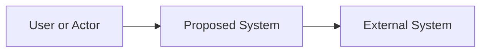
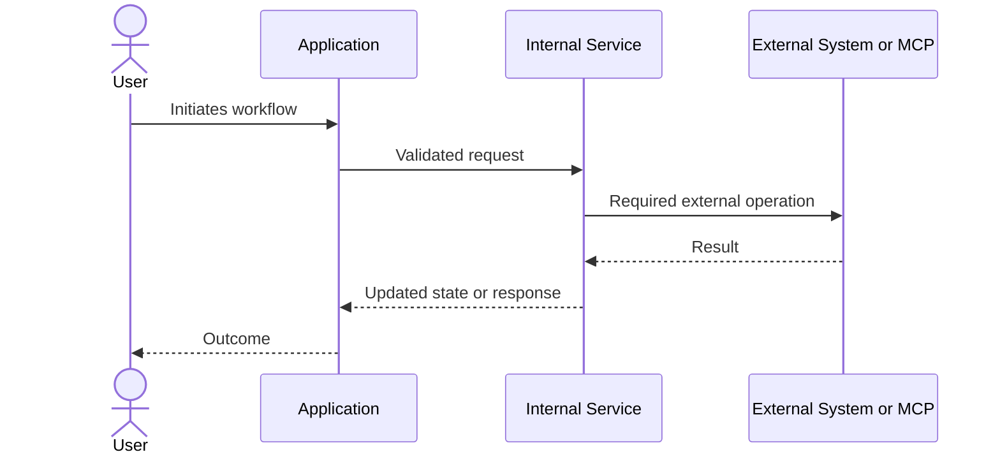

# Software Specification and Architecture Workspace

> Paste your existing specification into the **Raw Specification** section without rewriting it. Treat that section as the source of truth. Complete the later sections collaboratively after the specification has been reviewed.

## Project Details

| Field                | Value                      |
| -------------------- | -------------------------- |
| Project name         | `[Project name]`           |
| Primary objective    | `[One-sentence objective]` |
| Specification status | Draft                      |
| Last updated         | `[YYYY-MM-DD]`             |

---

## 1. Raw Specification

### Source-of-Truth Specification

<!-- Paste the complete existing specification below. Keep its original wording. -->

```text
Invoice Processing & Approval System – Project Specification

1. Project Overview

The aim of this project is to create an automated invoice processing and approval system. My suggestion is to use our existing Microsoft 365 environment, primarily SharePoint, Power Automate and AI Builder.

At present, processing invoices involves a number of manual steps, including saving invoices, identifying which company they relate to, checking and matching invoices, sending them for approval, and tracking whether they have been approved, paid and reconciled.

The purpose of this project is to automate as much of this administration as reasonably possible, while keeping the actual approval, invoice matching and payment decisions with the relevant members of staff.

The system should also give us a clear record of where each invoice is within the process and provide an audit trail from receipt through to final filing.

2. General Process

The intended process is:

Invoice received by email
↓
PDF attachment saved into an Incoming Invoices folder in SharePoint
↓
Invoice information extracted
↓
Company being invoiced identified
↓
Invoice moved to the relevant company area
↓
Internal invoice reference / stamp number generated (IRJ number)
↓
System identifies whether the invoice relates to a Purchase Order (PO)
↓

If the invoice has a Purchase Order number:

Invoice moves to Purchase Order Invoice Matching
↓
Purchase Ledger manually matches the invoice against the Purchase Order and goods received information
↓

If the invoice matches correctly:
Purchase Ledger marks the invoice as matched/approved
↓
Invoice moves to Approved

If there is a difference or query:
For example, a price or quantity difference
↓
Purchase Ledger records the issue and sends the query to the relevant person in Purchasing
↓
Invoice remains outstanding while the query is investigated
↓
Once resolved, Purchase Ledger marks the invoice as matched/approved
↓
Invoice moves to Approved

If the invoice does not have a Purchase Order number:

Invoice moves to the Nominal Invoices process
↓
Supplier identified
↓
Correct approver(s) identified from the relevant company's approval matrix
↓
Invoice sent for approval
↓
Approver 1 notified by email
↓
If applicable, invoice sent to Approver 2 after the first approval
↓
Once fully approved, Purchase Ledger notified by email
↓
Invoice moves to Approved

From Approved:

Purchase Ledger processes payment and records the payment date
↓
Invoice moves to Bank Reconciliation
↓
Purchase Ledger confirms the payment has been reconciled against the bank
↓
Invoice moves to Complete / Filed

3. Invoice Receipt

Invoices will normally arrive by email as PDF attachments.

The system should monitor the relevant invoice mailbox and automatically save appropriate PDF invoice attachments into an Incoming Invoices folder in SharePoint.

The original email information should be retained where practical, for example:

Sender

Date received

Email subject

There should also be a way of manually adding an invoice to the Incoming Invoices folder so that invoices received outside of the normal email process can still enter the same workflow.

4. Reading and Filing the Invoice

Once an invoice has been added to Incoming Invoices, AI Builder should read the document and extract the main information required.

This should include, where available:

Company being invoiced

Supplier

Supplier invoice number

Purchase Order number, if applicable

Whether the invoice should follow the Purchase Order or nominal invoice route

Invoice date

Invoice value

The company being invoiced should then be used to determine which company area in SharePoint the invoice belongs to.

The invoice should be moved into the appropriate company folder.

The system should also determine whether the invoice contains a Purchase Order number.

If a Purchase Order number is identified, the invoice should follow the Purchase Order Invoice Matching process.

If there is no Purchase Order number, the invoice should follow the Nominal Invoice Approval process.

If the system cannot confidently identify the company, supplier, Purchase Order information or other important information, it should not guess. The invoice should instead be flagged for someone to review manually.

5. Internal Invoice Reference / IRJ Number

Every invoice should be given a unique internal reference number, which we currently refer to as the IRJ number / stamp number.

The number should be generated automatically and should never be duplicated.

The IRJ number should remain associated with the invoice throughout the whole process.

Ideally, the IRJ number should be visible against the invoice in SharePoint and included in approval emails and other relevant notifications.

We can consider whether the IRJ number also needs to be physically stamped onto the PDF itself once the basic system is working.

6. Purchase Order Invoice Matching

Where an invoice contains a Purchase Order number, it should be moved into the relevant company's Purchase Order Invoice Matching area.

The Purchase Ledger team will manually check the invoice against the relevant Purchase Order and goods received information.

If the invoice matches correctly, Purchase Ledger should be able to mark the invoice as Matched / Approved.

This should then move the invoice into the Approved folder ready for payment.

If the invoice cannot be matched because of an issue such as:

Price difference

Quantity difference

Goods not received

Partial delivery

Other discrepancy

Purchase Ledger should be able to record a note against the invoice explaining the issue.

Where necessary, the query can then be referred to the relevant person in Purchasing for investigation.

The invoice should remain in an appropriate outstanding/query status until the issue has been resolved.

Once the query has been resolved and Purchase Ledger is satisfied that the invoice can be processed, they should be able to mark it as Matched / Approved, which will move it into the Approved folder.

A record of the query and any relevant notes should remain against the invoice for future reference.

7. Supplier and Approval Matrix – Nominal Invoices

Where an invoice does not have a Purchase Order number, it should follow the nominal invoice approval process.

Once the company and supplier have been identified, the system should determine who needs to approve the invoice.

Each company will have its own controlled approval matrix.

The approval matrix should contain the suppliers and the person or people responsible for approving invoices from that supplier.

Some invoices will require one approval, while others will require two approvals.

The approval matrix needs to be easy for an authorised member of staff to maintain without having to change the underlying Power Automate flows.

If a supplier cannot be found on the approval matrix, the invoice should be flagged for manual review rather than automatically sent to somebody.

8. Nominal Invoice Approval Process

Once the appropriate approver has been identified, the approval process should begin automatically.

The first approver should receive an email notification advising them that an invoice is awaiting their approval.

They should be able to view the invoice and either approve or reject it.

If only one approval is required, approving the invoice will complete the approval process.

If a second approval is required, the invoice should automatically move to the second approver after the first person has approved it.

The second approver should then receive their own notification.

The system should record who approved the invoice and when.

Approvers should also be able to add notes or comments against the invoice. This is particularly important where approval is being delayed because there is an issue under investigation, for example:

Price under query

Service or goods disputed

Further information required

Waiting for a credit note

Other reason for delaying approval

These notes should remain visible against the invoice so Purchase Ledger can understand why an invoice is still awaiting approval without having to chase the approver separately.

If an invoice is rejected, it should not continue through the normal approval process.

Its status should clearly show that it has been rejected, and the reason or comments provided by the approver should be available to Purchase Ledger.

9. Fully Approved Invoices

An invoice can reach the Approved stage in one of two ways:

A Purchase Order invoice has been successfully matched and approved by Purchase Ledger; or

A nominal invoice has completed all required approvals.

Once an invoice is fully approved:

The invoice status should change to Approved

The Purchase Ledger team should receive an email notification where appropriate

The invoice should move into the relevant Approved folder

Purchase Ledger can then process the invoice for payment.


10. Payment

Once an invoice has been paid, a member of the Purchase Ledger team should be able to mark it as Paid and enter the payment date.

Doing this should automatically:

Record who marked the invoice as paid

Record the payment date

Change the invoice status to Paid / Awaiting Bank Reconciliation

Move the invoice into the Bank Reconciliation folder

This should require a deliberate action by Purchase Ledger rather than happening automatically simply because an invoice has been approved.

Purchase Ledger should also be able to add additional payment information or notes against the invoice, for example:

Bank payment reference

BACS payment reference/details

Payment run reference

Cheque/reference number, if applicable

Any other relevant payment information

This information should remain with the invoice as part of its history.

11. Bank Reconciliation

Once the payment has appeared on the bank and has been reconciled, Purchase Ledger should be able to mark the invoice as Reconciled.

The system should record:

Reconciliation date

Who completed the reconciliation, where practical

Any relevant reconciliation notes, if required

The invoice should then automatically move into the Complete / Filed folder.

At this point the invoice workflow is complete.


12. Invoice Status and History

We should be able to see the current status of an invoice without having to open the PDF.

Suggested statuses include:

Incoming / Processing

Needs Review

Awaiting PO Matching

PO Query / Matching Issue

Awaiting Approval 1

Awaiting Approval 2

Approval Query / On Hold

Rejected

Approved

Paid / Awaiting Bank Reconciliation

Reconciled / Complete

We should also retain useful information against each invoice, including:

IRJ number

Company

Supplier

Supplier invoice number

Purchase Order number, where applicable

Invoice type – PO or Nominal

Invoice date

Invoice value

Date received

Current status

Approver 1

Approver 1 decision and date

Approver 1 comments

Approver 2, where applicable

Approver 2 decision and date

Approver 2 comments

Purchase Order matching status

Purchase Order query notes, where applicable

Payment date

Payment reference / notes

Reconciliation date

The intention is to create a useful audit trail showing what has happened to an invoice from the point it was received through to final reconciliation.

13. Exceptions and Errors

The system needs to deal sensibly with situations where something does not work as expected.

Examples include:

The PDF cannot be read

The company cannot be identified

The supplier cannot be identified

It is unclear whether the invoice is a PO or nominal invoice

A Purchase Order number cannot be read correctly

A Purchase Order invoice does not match

The supplier is not on the approval matrix

An approver has not been set up

An invoice is rejected

A duplicate invoice is received

A Power Automate process fails

In these circumstances, the invoice should generally be flagged for review rather than being allowed to continue incorrectly.

It should be easy for Purchase Ledger or an administrator to identify invoices requiring attention and understand why they have been stopped.

14. Initial Project Approach

I would like the project to be developed in stages rather than attempting to build the entire system at once.

The first stage should be to fully understand the requirements and propose the SharePoint structure and overall workflow.

I would then like the core invoice receipt and filing process to be developed and tested before moving on to the approval, payment and reconciliation stages.

The project should be built in a way that allows us to test each part of the process before moving on to the next stage.

The system should also be designed so that it can be amended and expanded in the future without having to rebuild the whole process.

15. Overall Objective

The finished system should provide a clear process for an invoice from receipt through to final filing.

For a Purchase Order invoice:

Received → Identified → Filed → Numbered → PO Matched → Approved → Paid → Reconciled → Complete

For a Nominal invoice:

Received → Identified → Filed → Numbered → Sent for Approval → Approved → Paid → Reconciled → Complete

The main priorities are that the system is:

Reliable

Easy for staff to use

Easy to understand

Able to provide a clear audit trail

Easy to maintain as suppliers, companies and approvers change

Able to show clearly where every invoice is within the process

Where automation cannot make a reliable decision, it should pass the invoice to a person for review rather than making assumptions.

The overall aim is not to remove human control from the invoice process, but to remove unnecessary administration and make it easier to see, manage and track invoices from the moment they are received until they are fully paid, reconciled and filed.

As a last step I would like to look at adding a BI dashboard to show a number of different KPIS
```

### Supporting Material

- References: `[Links, documents, sketches, or existing systems]`
- Known constraints: `[Deadlines, budget, platforms, policies, or required technologies]`
- Existing assets: `[Code, APIs, databases, designs, credentials, or infrastructure]`

---

## 2. Specification Analysis

> Complete this section by extracting information from the raw specification. Label anything not explicitly stated as an assumption or recommendation.

### Goals and Success Measures

| Goal     | Success measure                      | Source              |
| -------- | ------------------------------------ | ------------------- |
| `[Goal]` | `[Observable or measurable outcome]` | Confirmed / Assumed |

### Users and Actors

| User or actor | Needs    | Key actions | Access level    |
| ------------- | -------- | ----------- | --------------- |
| `[Actor]`     | `[Need]` | `[Actions]` | `[Permissions]` |

### Functional Requirements

| ID     | Requirement            | Priority              | Source               | Acceptance signal                  |
| ------ | ---------------------- | --------------------- | -------------------- | ---------------------------------- |
| FR-001 | `[The system must...]` | Must / Should / Could | Confirmed / Inferred | `[How completion is demonstrated]` |

### Non-Functional Requirements

| Area          | Requirement     | Target                              | Source              |
| ------------- | --------------- | ----------------------------------- | ------------------- |
| Performance   | `[Requirement]` | `[Metric or threshold]`             | Confirmed / Assumed |
| Reliability   | `[Requirement]` | `[Availability or recovery target]` | Confirmed / Assumed |
| Security      | `[Requirement]` | `[Control or standard]`             | Confirmed / Assumed |
| Accessibility | `[Requirement]` | `[Standard or expectation]`         | Confirmed / Assumed |
| Scalability   | `[Requirement]` | `[Expected usage or growth]`        | Confirmed / Assumed |

### Data and Content

| Data or content | Source     | Owner     | Sensitivity                   | Retention  | Consumers               |
| --------------- | ---------- | --------- | ----------------------------- | ---------- | ----------------------- |
| `[Data type]`   | `[Origin]` | `[Owner]` | Public / Internal / Sensitive | `[Policy]` | `[Components or users]` |

### External Systems and Integrations

| System              | Purpose              | Interface                    | Authentication  | Direction                 |
| ------------------- | -------------------- | ---------------------------- | --------------- | ------------------------- |
| `[External system]` | `[Why it is needed]` | API / MCP / SDK / CLI / File | `[Auth method]` | Inbound / Outbound / Both |

### Scope

**In scope**

- `[Included capability]`

**Out of scope**

- `[Explicitly excluded capability]`

### Assumptions

| ID    | Assumption     | Impact if incorrect | Validation method  | Status |
| ----- | -------------- | ------------------- | ------------------ | ------ |
| A-001 | `[Assumption]` | `[Impact]`          | `[How to confirm]` | Open   |

### Open Questions

| ID    | Question     | Why it matters                  | Owner     | Status |
| ----- | ------------ | ------------------------------- | --------- | ------ |
| Q-001 | `[Question]` | `[Decision or design affected]` | `[Owner]` | Open   |

---

## 3. Proposed Software Structure

> Fill this section only after the raw specification has been analyzed.

### System Context



### Architecture Summary

`[Describe the proposed architecture, its main boundaries, and why it fits the specification.]`

### Components and Responsibilities

| Component     | Responsibility                  | Inputs     | Outputs     | Owns data? | Dependencies     |
| ------------- | ------------------------------- | ---------- | ----------- | ---------- | ---------------- |
| `[Component]` | `[Single clear responsibility]` | `[Inputs]` | `[Outputs]` | Yes / No   | `[Dependencies]` |

### Interfaces and Contracts

| From          | To                   | Interface                            | Request/input | Response/output | Failure behavior      |
| ------------- | -------------------- | ------------------------------------ | ------------- | --------------- | --------------------- |
| `[Component]` | `[Component/system]` | HTTP / Event / Function / MCP / File | `[Shape]`     | `[Shape]`       | `[Expected handling]` |

### Data Ownership and Persistence

| Store or entity  | Owning component | Technology recommendation | Read/write pattern | Backup or recovery |
| ---------------- | ---------------- | ------------------------- | ------------------ | ------------------ |
| `[Entity/store]` | `[Owner]`        | `[To be decided]`         | `[Pattern]`        | `[Requirement]`    |

### Runtime and Deployment

- Runtime environments: `[Local, development, staging, production]`
- Deployment model: `[Server, serverless, desktop, mobile, container, scheduled job, etc.]`
- Configuration and secrets: `[Storage and injection approach]`
- Observability: `[Logging, metrics, tracing, alerts]`
- Scaling model: `[Expected scaling approach]`

### Suggested Directory Structure

```text
[project-root]/
├── src/
│   ├── [component-or-layer]/
│   └── [component-or-layer]/
├── tests/
├── docs/
└── [configuration-files]
```

**Structure rationale:** `[Explain how the proposed layout reflects component boundaries and expected workflows.]`

---

## 4. MCP Assessment

> An MCP is not automatically required for every integration. Compare it with a direct API, SDK, CLI, webhook, database connection, or local implementation.

### Capability-to-Tool Matrix

| Required capability | External system | Interaction needed               | Candidate approach            | MCP needed?            | Rationale                 |
| ------------------- | --------------- | -------------------------------- | ----------------------------- | ---------------------- | ------------------------- |
| `[Capability]`      | `[System]`      | Read / Write / Execute / Monitor | MCP / API / SDK / CLI / Local | Yes / No / Investigate | `[Evidence-based reason]` |

### Proposed MCPs

| MCP server   | Purpose              | Tools/resources needed | Authentication | Permissions         | Data exposed               | Alternative              |
| ------------ | -------------------- | ---------------------- | -------------- | ------------------- | -------------------------- | ------------------------ |
| `[MCP name]` | `[Specific purpose]` | `[Capabilities used]`  | `[Method]`     | `[Least privilege]` | `[Data crossing boundary]` | `[API/SDK/other option]` |

### MCP Decision Checklist

For every proposed MCP, confirm:

- [ ] The specification requires access to the external capability.
- [ ] The MCP exposes the exact tools or resources needed.
- [ ] An MCP is preferable to a simpler direct integration.
- [ ] Authentication and least-privilege permissions are defined.
- [ ] Sensitive data exposure and retention are understood.
- [ ] Timeouts, rate limits, retries, and unavailable-server behavior are defined.
- [ ] A fallback or explicit failure path exists where required.
- [ ] The MCP server is trusted, maintained, and compatible with the target environment.

### MCP Configuration Notes

```text
[Record server commands or endpoints, required environment variables, setup steps,
and environment-specific differences. Do not place secret values in this document.]
```

---

## 5. Program Flow

### Primary End-to-End Flow

| Step | Actor/component | Action     | Input     | Output/state change | External call          |
| ---- | --------------- | ---------- | --------- | ------------------- | ---------------------- |
| 1    | `[Actor]`       | `[Action]` | `[Input]` | `[Output or state]` | `[System/MCP or none]` |

### Sequence Diagram



### Alternate Flows

| Flow ID | Trigger       | Steps that differ      | Result      |
| ------- | ------------- | ---------------------- | ----------- |
| AF-001  | `[Condition]` | `[Alternate sequence]` | `[Outcome]` |

### Errors and Recovery

| Failure          | Detection        | User-visible behavior   | Retry/recovery | Logging or alerting |
| ---------------- | ---------------- | ----------------------- | -------------- | ------------------- |
| `[Failure case]` | `[How detected]` | `[Message or behavior]` | `[Policy]`     | `[Required signal]` |

### Human Approval Points

| Decision     | Approver | Information shown | Approve result | Reject result  |
| ------------ | -------- | ----------------- | -------------- | -------------- |
| `[Decision]` | `[Role]` | `[Context]`       | `[Next state]` | `[Next state]` |

### State Transitions

| Current state | Event     | Guard/condition | Next state | Side effects |
| ------------- | --------- | --------------- | ---------- | ------------ |
| `[State]`     | `[Event]` | `[Condition]`   | `[State]`  | `[Actions]`  |

---

## 6. Implementation Plan

### Milestones

| Milestone | Deliverable     | Dependencies     | Completion criteria    |
| --------- | --------------- | ---------------- | ---------------------- |
| M1        | `[Deliverable]` | `[Dependencies]` | `[Verifiable outcome]` |

### Dependency Order

1. `[Foundation or prerequisite]`
2. `[Core capability]`
3. `[Integration]`
4. `[User-facing flow]`
5. `[Hardening and release]`

### Testing Strategy

| Test level  | Scope                               | Critical cases | Environment/tools    |
| ----------- | ----------------------------------- | -------------- | -------------------- |
| Unit        | `[Modules]`                         | `[Cases]`      | `[Framework]`        |
| Integration | `[Boundaries]`                      | `[Cases]`      | `[Systems or fakes]` |
| End-to-end  | `[User flows]`                      | `[Cases]`      | `[Environment]`      |
| Operational | `[Resilience/security/performance]` | `[Cases]`      | `[Approach]`         |

### Risks

| Risk     | Likelihood          | Impact              | Mitigation     | Owner     |
| -------- | ------------------- | ------------------- | -------------- | --------- |
| `[Risk]` | Low / Medium / High | Low / Medium / High | `[Mitigation]` | `[Owner]` |

### Security and Privacy

- Authentication: `[Approach]`
- Authorization: `[Roles and permission boundaries]`
- Sensitive data: `[Collection, storage, transmission, and deletion]`
- Secret management: `[Approach]`
- Audit requirements: `[Events and retention]`
- Threats requiring explicit controls: `[Threats]`

### Acceptance Criteria

- [ ] `[User-visible or measurable result]`
- [ ] `[Reliability, security, or performance threshold]`
- [ ] `[Required integration behavior]`

---

## 7. Decision Log

| Date           | Decision     | Alternatives considered | Reason        | Status                        |
| -------------- | ------------ | ----------------------- | ------------- | ----------------------------- |
| `[YYYY-MM-DD]` | `[Decision]` | `[Alternatives]`        | `[Rationale]` | Proposed / Accepted / Revisit |

---

## 8. Implementation Readiness Checklist

- [ ] The raw specification is complete and remains unchanged.
- [ ] Confirmed requirements are separated from assumptions and recommendations.
- [ ] Open questions that block architecture decisions are resolved.
- [ ] Scope and acceptance criteria are explicit.
- [ ] Components have clear responsibilities and ownership boundaries.
- [ ] Data sources, sensitivity, ownership, and retention are defined.
- [ ] External integrations and their failure behavior are understood.
- [ ] Each proposed MCP is justified against simpler alternatives.
- [ ] Authentication, permissions, and secret management are defined.
- [ ] Primary, alternate, error, recovery, and approval flows are documented.
- [ ] Testing covers critical requirements and integration boundaries.
- [ ] Milestones are ordered by dependency and have verifiable completion criteria.

## Working Convention

Use these labels while refining the document:

- **Confirmed:** Explicitly stated in the raw specification or confirmed by the project owner.
- **Inferred:** Derived from the specification but not directly stated.
- **Assumption:** Temporarily accepted and still needs validation.
- **Recommendation:** A proposed design or technology choice.
- **Open:** A question or decision that has not been resolved.
